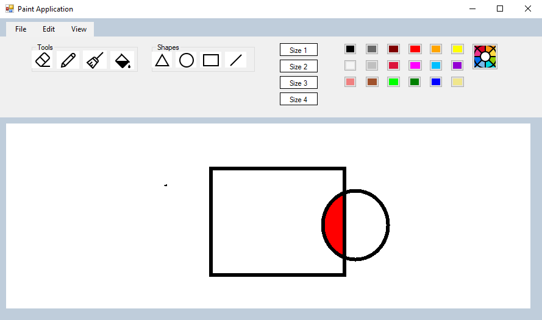

<h1>Paint Application C# Project</h1>
<table>
  <tr>
    <td style="width: 35%; vertical-align: top;">
      
    </td>
    <td style="width: 65%; vertical-align: top;">
      <h3>Features</h3>
      

      <ul>
        <li>Shapes</li>
        <li>Colors</li>
        <li>Fill up</li>
      </ul>
    </td>
  </tr>
</table>

### Installation
[Download the latest version here.](https://github.com/temesgen-982/paint-applicatin-c-sharp/releases/download/v1.0.0/SetupPaintapplication.msi)
